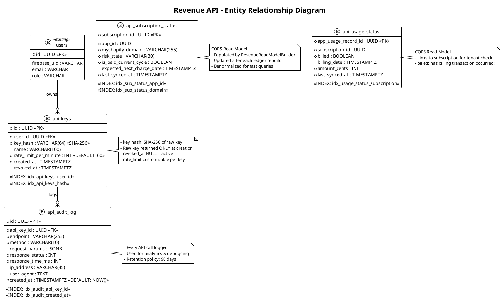

# Feature Discussion – LedgerGuard

Track feature discussions and planning before implementation.

---

## Current Status

### Implemented
- Authentication (Firebase Auth, Google Sign-In)
- Partner Integration (OAuth, Manual Token)
- App Selection
- Executive Dashboard (KPIs, Time Filtering, Delta Comparison)
- Risk Breakdown Page
- Subscription List & Detail
- AI Insight Card (Pro tier)
- Notification Settings
- Profile Page
- Mobile Responsive Layouts

### Pending from Plan
- Dashboard "View All" button (risk breakdown → subscription list)

---

## Feature Discussion Log

### Session: 2026-02-27

**Topic:** Revenue API (External Access Layer)

**Overview:**
New module allowing Shopify app developers to query subscription payment status and usage billing status via API.

**Phased Approach:**
- **Phase 1:** REST API (MVP) - Implement fully
- **Phase 2:** GraphQL (future-ready) - Structure only, no implementation

---

## Revenue API Specification

### Architecture Rules

1. Follow Clean Architecture (Go backend)
2. Do NOT mix core ledger DB with external API read logic
3. Implement CQRS-style read model
4. REST now, GraphQL-ready later
5. Update all documentation (PRD, TAD, DATABASE_SCHEMA, DECISIONS, TEST_PLAN, future.md, PlantUML diagrams)

### Phase 1 Implementation Steps

#### Step 1: Database Extension

**New Tables:**

```sql
-- API Keys for external access
api_keys (
    id UUID PRIMARY KEY,
    user_id UUID NOT NULL REFERENCES users(id),
    key_hash VARCHAR(64) NOT NULL,  -- SHA-256 hash
    name VARCHAR(100),              -- User-friendly name
    created_at TIMESTAMP NOT NULL,
    revoked_at TIMESTAMP,
    rate_limit_per_minute INT DEFAULT 60
)

-- Read model: Subscription status (CQRS)
api_subscription_status (
    subscription_id UUID PRIMARY KEY,
    app_id UUID NOT NULL,
    myshopify_domain VARCHAR(255) NOT NULL,
    risk_state VARCHAR(50) NOT NULL,
    is_paid_current_cycle BOOLEAN NOT NULL,
    expected_next_charge_date TIMESTAMP,
    last_synced_at TIMESTAMP NOT NULL
)

-- Read model: Usage billing status (CQRS)
api_usage_status (
    app_usage_record_id UUID PRIMARY KEY,
    subscription_id UUID NOT NULL,
    billed BOOLEAN NOT NULL,
    billing_date TIMESTAMP,
    amount_cents INT NOT NULL,
    last_synced_at TIMESTAMP NOT NULL
)

-- API Audit Log (separate from core ledger)
api_audit_log (
    id UUID PRIMARY KEY,
    api_key_id UUID NOT NULL REFERENCES api_keys(id),
    endpoint VARCHAR(255) NOT NULL,
    method VARCHAR(10) NOT NULL,
    request_params JSONB,
    response_status INT NOT NULL,
    response_time_ms INT NOT NULL,
    ip_address VARCHAR(45),
    user_agent TEXT,
    created_at TIMESTAMP NOT NULL DEFAULT NOW()
)
```

#### Step 2: Read Model Population

**Service:** `RevenueReadModelBuilder`

- Triggered after every ledger rebuild
- Populates `api_subscription_status` and `api_usage_status`
- Uses existing ledger state (NO Shopify re-sync)
- Idempotent operation

#### Step 3: API Key System

**Endpoints:**
```
POST   /api/v1/api-keys         (OWNER only) - Create key
GET    /api/v1/api-keys         (OWNER only) - List keys
DELETE /api/v1/api-keys/{id}    (OWNER only) - Revoke key
```

**Security:**
- Store only hashed keys (SHA-256)
- Return raw key ONLY at creation (one-time)
- Implement `X-API-KEY` header validation middleware
- Attach user context from key
- Enforce per-key rate limiting

#### Step 4: REST Endpoints

**Subscription Status:**
```
GET /v1/subscription/{subscription_id}/status

Response:
{
    "subscription_id": "uuid",
    "risk_state": "SAFE|ONE_CYCLE_MISSED|TWO_CYCLES_MISSED|CHURNED",
    "is_paid_current_cycle": true,
    "expected_next_charge_date": "2024-03-15T00:00:00Z"
}
```

**Usage Status:**
```
GET /v1/usage/{usage_id}/status

Response:
{
    "usage_id": "uuid",
    "billed": true,
    "billing_date": "2024-02-28T00:00:00Z",
    "amount_cents": 1500
}
```

**Batch Subscription Status:**
```
POST /v1/subscriptions/status/batch

Request:
{
    "subscription_ids": ["uuid1", "uuid2", "uuid3"]
}

Response:
{
    "results": [
        {
            "subscription_id": "uuid1",
            "risk_state": "SAFE",
            "is_paid_current_cycle": true,
            "expected_next_charge_date": "2024-03-15T00:00:00Z"
        },
        ...
    ],
    "not_found": ["uuid3"]
}
```

**Batch Usage Status:**
```
POST /v1/usage/status/batch

Request:
{
    "usage_ids": ["uuid1", "uuid2"]
}

Response:
{
    "results": [
        {
            "usage_id": "uuid1",
            "billed": true,
            "billing_date": "2024-02-28T00:00:00Z",
            "amount_cents": 1500
        },
        ...
    ],
    "not_found": []
}
```

**Rules:**
- Tenant isolation (user can only access their own app data)
- Return 404 if not found or unauthorized (single queries)
- Batch queries return `not_found` array for missing IDs
- Batch limit: 100 IDs per request
- Rate limiting enforced

#### Step 5: Security

- Per-key rate limiting middleware
- Audit log for API usage
- Mask sensitive internal fields
- Integration tests for all scenarios

#### Step 6: Documentation Updates

| Document | Updates |
|----------|---------|
| PRD.md | Add Revenue API module (Pro/Enterprise tier) |
| TAD.md | Add Revenue API Layer + CQRS read model |
| DATABASE_SCHEMA.md | Add new tables |
| DECISIONS.md | ADR for CQRS pattern, API key security |
| TEST_PLAN.md | Add Revenue API test scenarios |
| future.md | GraphQL Phase 2 plan |
| C4.puml | Add Revenue API component |
| ER.puml | Add api_keys, api_subscription_status, api_usage_status |
| SEQUENCE.puml | Add Developer → Revenue API → Read Model flow |

### Phase 2: GraphQL (Future - DO NOT IMPLEMENT)

**Add to future.md:**
- GraphQL endpoint `/graphql`
- Uses read-model tables only
- Schema:
  - `subscription(id)` - Single subscription status
  - `usage(id)` - Single usage status
  - `subscriptions(filter)` - Filtered list
  - `usageRecords(filter)` - Filtered list

**Prepare structure:**
- Create placeholder: `internal/revenue_api/graphql/` (empty)
- REST handlers call application layer services
- GraphQL resolvers will reuse same services later

### Test Requirements

| Test Category | Scenarios |
|---------------|-----------|
| API Key | Creation, validation, revocation |
| Rate Limiting | Enforcement, per-key limits |
| Subscription Status | Success, not found, unauthorized |
| Usage Status | Success, not found, unauthorized |
| Tenant Isolation | Cross-user access denied |
| Read Model | Population after ledger rebuild |

### Directory Structure (Proposed)

```
internal/
├── revenue_api/
│   ├── application/
│   │   └── service/
│   │       ├── subscription_status_service.go
│   │       ├── usage_status_service.go
│   │       └── api_key_service.go
│   ├── domain/
│   │   ├── entity/
│   │   │   ├── api_key.go
│   │   │   ├── subscription_status.go
│   │   │   └── usage_status.go
│   │   └── repository/
│   │       ├── api_key_repository.go
│   │       ├── subscription_status_repository.go
│   │       └── usage_status_repository.go
│   ├── infrastructure/
│   │   └── persistence/
│   │       ├── api_key_repository.go
│   │       ├── subscription_status_repository.go
│   │       └── usage_status_repository.go
│   ├── interfaces/
│   │   └── http/
│   │       ├── handler/
│   │       │   ├── api_key_handler.go
│   │       │   ├── subscription_status_handler.go
│   │       │   └── usage_status_handler.go
│   │       └── middleware/
│   │           ├── api_key_auth.go
│   │           └── rate_limiter.go
│   └── graphql/              # Phase 2 placeholder (empty)
```

---

## Questions Before Implementation

1. **Rate Limiting Strategy:** In-memory (Redis) or database-backed? → **Redis**
2. **Audit Log Table:** Separate table or append to existing logs? → **Separate table** (better for CQRS separation, easier analytics)
3. **API Versioning:** Path-based (`/v1/`) confirmed? → **Yes**
4. **Key Rotation:** Should we support key rotation or just revoke+create? → **Revoke + create new**
5. **Batch Queries:** Allow batch subscription/usage lookups in Phase 1? → **Yes, allow**

---

## Decision Log

| Date | Decision | Rationale |
|------|----------|-----------|
| 2026-02-27 | CQRS read model | Separate read concerns from write ledger |
| 2026-02-27 | Phased approach (REST → GraphQL) | MVP fast, future-ready |
| 2026-02-27 | Hashed API keys only | Security best practice |
| 2026-02-27 | Redis for rate limiting | Distributed, fast, supports TTL natively |
| 2026-02-27 | Separate api_audit_log table | CQRS separation, easier API analytics |
| 2026-02-27 | No key rotation | Simpler MVP, revoke+create sufficient |
| 2026-02-27 | Batch queries in Phase 1 | Developer convenience, reduce API calls |
| 2026-02-27 | Separate PUML files for Revenue API | Clean separation, easier maintenance |
| 2026-02-27 | Revenue API as separate container | Physical isolation from core API |
| 2026-02-27 | Redis in C4 + Sequence diagrams | Full visibility of rate limiting flow |
| 2026-02-27 | Read model population as separate flow | Clear trigger point after ledger rebuild |

---

## PlantUML Diagram Specifications

### New Files to Create

| File | Description |
|------|-------------|
| `docs/C4_revenue_api.puml` | Component diagram for Revenue API |
| `docs/ER_revenue_api.puml` | Entity relationships for API tables |
| `docs/SEQUENCE_revenue_api.puml` | All Revenue API flows |

---

### C4_revenue_api.puml

```plantuml
@startuml C4_Revenue_API
!include https://raw.githubusercontent.com/plantuml-stdlib/C4-PlantUML/master/C4_Container.puml

title LedgerGuard - Revenue API (C4 Container Diagram)

' External Actors
Person_Ext(ext_developer, "External Developer", "Shopify app developer querying payment status")
Person(owner, "App Owner", "Manages API keys")

' External Systems
System_Ext(shopify_app, "Shopify App", "Developer's app calling Revenue API")
ContainerDb_Ext(redis, "Redis", "Rate limiting & caching")

' System Boundary
System_Boundary(ledgerguard, "LedgerGuard Platform") {

    ' Core API (existing)
    Container(core_api, "Core API", "Go", "Authentication, Sync, Dashboard")
    ContainerDb(postgres_core, "PostgreSQL (Core)", "Ledger, Subscriptions, Metrics")

    ' Revenue API (new - separate container)
    Container(revenue_api, "Revenue API", "Go", "External status queries\nCQRS Read Model")
    ContainerDb(postgres_read, "PostgreSQL (Read Model)", "api_subscription_status\napi_usage_status\napi_keys\napi_audit_log")
}

' Relationships - External Developer
Rel(ext_developer, shopify_app, "Integrates")
Rel(shopify_app, revenue_api, "X-API-KEY header\nGET /v1/subscription/{id}/status\nGET /v1/usage/{id}/status\nPOST /v1/*/batch", "HTTPS/REST")

' Relationships - Owner
Rel(owner, core_api, "Manages API keys\nPOST/GET/DELETE /api/v1/api-keys", "HTTPS/REST")

' Internal Relationships
Rel(revenue_api, redis, "Check rate limit\nIncrement counter", "TCP")
Rel(revenue_api, postgres_read, "Query status", "SQL")
Rel(core_api, postgres_core, "Write ledger", "SQL")
Rel(core_api, postgres_read, "Populate read model\n(after ledger rebuild)", "SQL")

SHOW_LEGEND()
@enduml
```

---

### C4_revenue_api_components.puml

```plantuml
@startuml C4_Revenue_API_Components
!include https://raw.githubusercontent.com/plantuml-stdlib/C4-PlantUML/master/C4_Component.puml

title Revenue API - Component Diagram

ContainerDb_Ext(redis, "Redis", "Rate limiting")
ContainerDb_Ext(postgres, "PostgreSQL", "Read model tables")

Container_Boundary(revenue_api, "Revenue API Container") {

    ' HTTP Layer
    Component(router, "Router", "Chi Router", "Route definitions")
    Component(apikey_auth_mw, "ApiKeyAuthMiddleware", "Middleware", "Validate X-API-KEY\nAttach user context")
    Component(rate_limiter_mw, "RateLimiterMiddleware", "Middleware", "Per-key rate limiting\nRedis-backed")
    Component(audit_mw, "AuditMiddleware", "Middleware", "Log all API calls")

    ' Handlers
    Component(apikey_handler, "ApiKeyHandler", "HTTP Handler", "POST/GET/DELETE /api/v1/api-keys")
    Component(sub_status_handler, "SubscriptionStatusHandler", "HTTP Handler", "GET /v1/subscription/{id}/status\nPOST /v1/subscriptions/status/batch")
    Component(usage_status_handler, "UsageStatusHandler", "HTTP Handler", "GET /v1/usage/{id}/status\nPOST /v1/usage/status/batch")

    ' Application Services
    Component(apikey_service, "ApiKeyService", "App Service", "Create, validate, revoke keys")
    Component(sub_status_service, "SubscriptionStatusService", "App Service", "Query subscription status")
    Component(usage_status_service, "UsageStatusService", "App Service", "Query usage billing status")

    ' Domain
    Component(apikey_entity, "ApiKey", "Entity", "id, user_id, key_hash, rate_limit")
    Component(sub_status_entity, "SubscriptionStatus", "Entity", "subscription_id, risk_state, is_paid")
    Component(usage_status_entity, "UsageStatus", "Entity", "usage_id, billed, amount")

    ' Repositories
    Component(apikey_repo, "ApiKeyRepository", "Repository", "CRUD for api_keys")
    Component(sub_status_repo, "SubscriptionStatusRepository", "Repository", "Query api_subscription_status")
    Component(usage_status_repo, "UsageStatusRepository", "Repository", "Query api_usage_status")
    Component(audit_repo, "AuditLogRepository", "Repository", "Insert api_audit_log")
}

' External Component (in Core API)
Component_Ext(read_model_builder, "RevenueReadModelBuilder", "Core API Service", "Populates read model\nafter ledger rebuild")

' Relationships
Rel(router, apikey_auth_mw, "All /v1/* routes")
Rel(apikey_auth_mw, rate_limiter_mw, "If valid key")
Rel(rate_limiter_mw, audit_mw, "If within limit")
Rel(audit_mw, sub_status_handler, "/v1/subscription/*")
Rel(audit_mw, usage_status_handler, "/v1/usage/*")
Rel(router, apikey_handler, "/api/v1/api-keys (Firebase auth)")

Rel(apikey_handler, apikey_service, "Uses")
Rel(sub_status_handler, sub_status_service, "Uses")
Rel(usage_status_handler, usage_status_service, "Uses")

Rel(apikey_service, apikey_repo, "Uses")
Rel(sub_status_service, sub_status_repo, "Uses")
Rel(usage_status_service, usage_status_repo, "Uses")
Rel(audit_mw, audit_repo, "Logs")

Rel(rate_limiter_mw, redis, "Check/increment")
Rel(apikey_repo, postgres, "SQL")
Rel(sub_status_repo, postgres, "SQL")
Rel(usage_status_repo, postgres, "SQL")
Rel(audit_repo, postgres, "SQL")

Rel(read_model_builder, postgres, "Populate after rebuild")

SHOW_LEGEND()
@enduml
```

---

### ER_revenue_api.puml



---

### SEQUENCE_revenue_api.puml (Flows)

**Flow 1: API Key Creation**
```
OWNER → Core API → Hash key → Store → Return raw key (once)
```

**Flow 2: API Key Authentication**
```
Request → X-API-KEY → Hash → Lookup → Validate not revoked → Rate limit check (Redis) → Attach context
```

**Flow 3: Subscription Status Query (Single)**
```
Developer → Revenue API → Auth middleware → Rate limit → Query read model → Return status
```

**Flow 4: Subscription Status Query (Batch)**
```
Developer → Revenue API → Auth → Rate limit → Bulk query → Return results + not_found[]
```

**Flow 5: Usage Status Query**
```
Developer → Revenue API → Auth → Rate limit → Query read model → Return billed status
```

**Flow 6: Read Model Population**
```
Ledger Rebuild completes → RevenueReadModelBuilder →
  For each subscription: Upsert api_subscription_status
  For each usage record: Upsert api_usage_status
```

**Flow 7: Rate Limit Enforcement**
```
Request → Get key's rate_limit → Redis INCR key:{api_key_id}:minute →
  If count > limit: 429 Too Many Requests
  Else: Continue
```

---

## Implementation Checklist

### Phase 1: REST Revenue API

- [ ] **Step 1:** Database migration (api_keys, api_subscription_status, api_usage_status)
- [ ] **Step 2:** RevenueReadModelBuilder service
- [ ] **Step 3:** API key management (create, list, revoke)
- [ ] **Step 4:** API key auth middleware + rate limiter
- [ ] **Step 5:** Subscription status endpoint
- [ ] **Step 6:** Usage status endpoint
- [ ] **Step 7:** Integration tests
- [ ] **Step 8:** Documentation updates
- [ ] **Step 9:** Phase 2 placeholder structure

---
