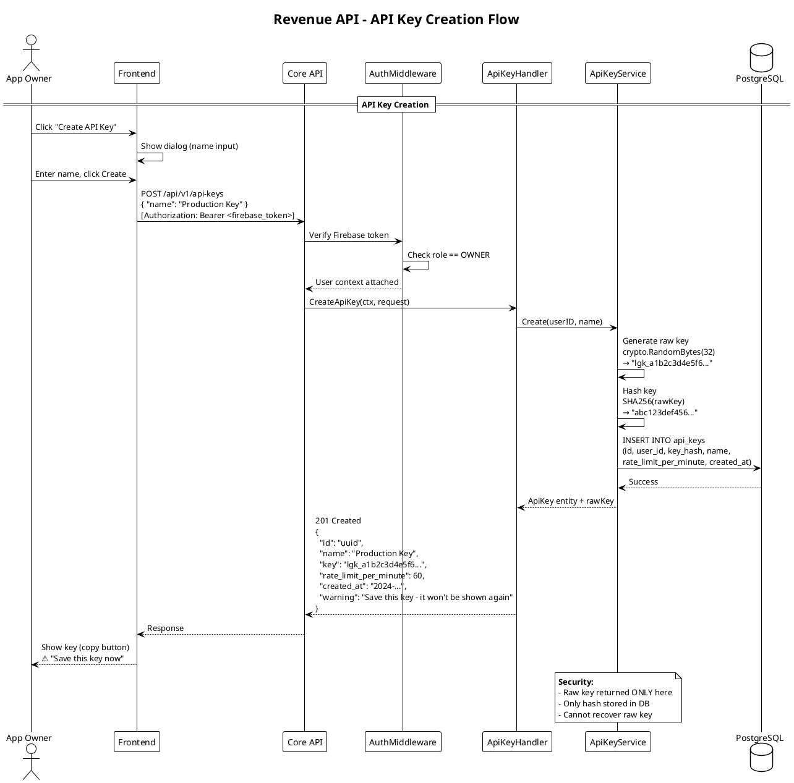
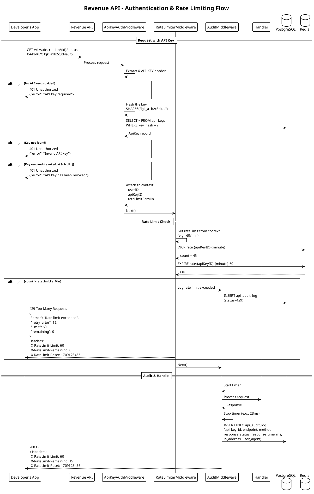
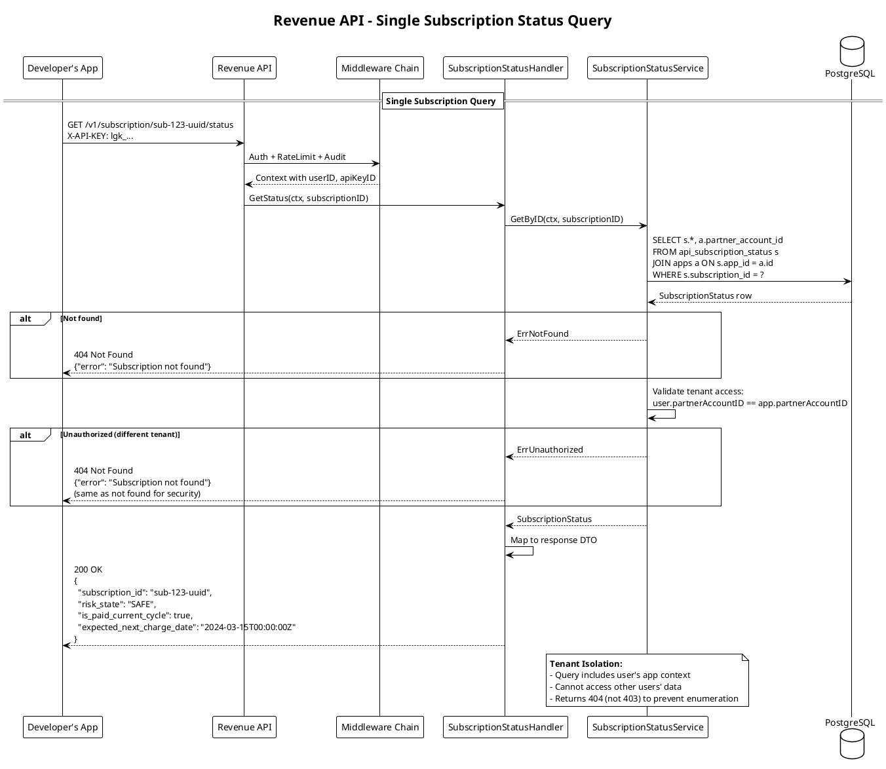
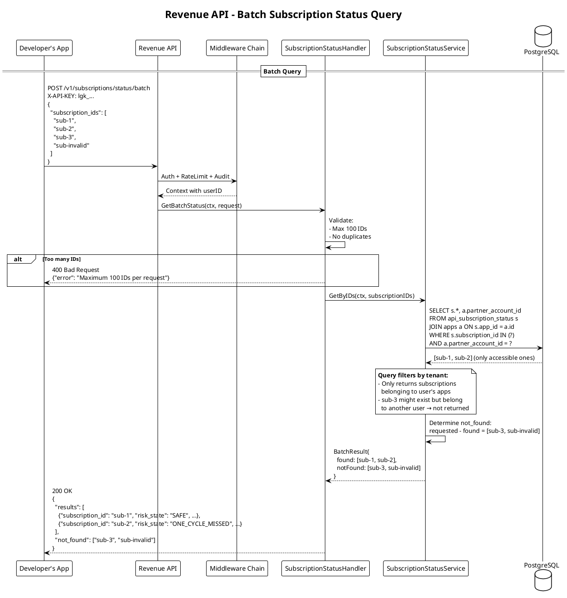
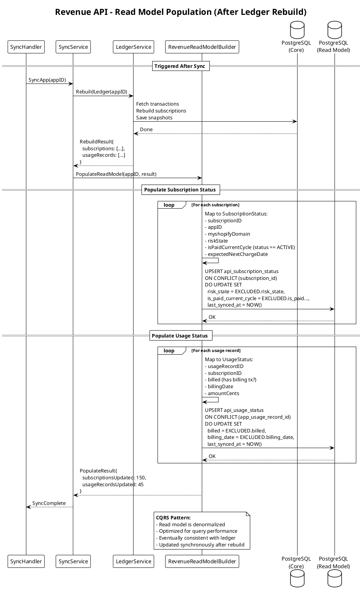
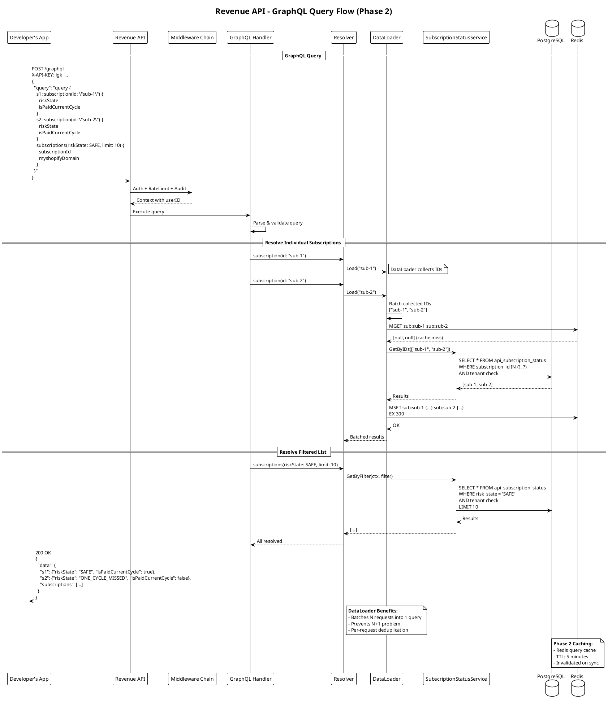
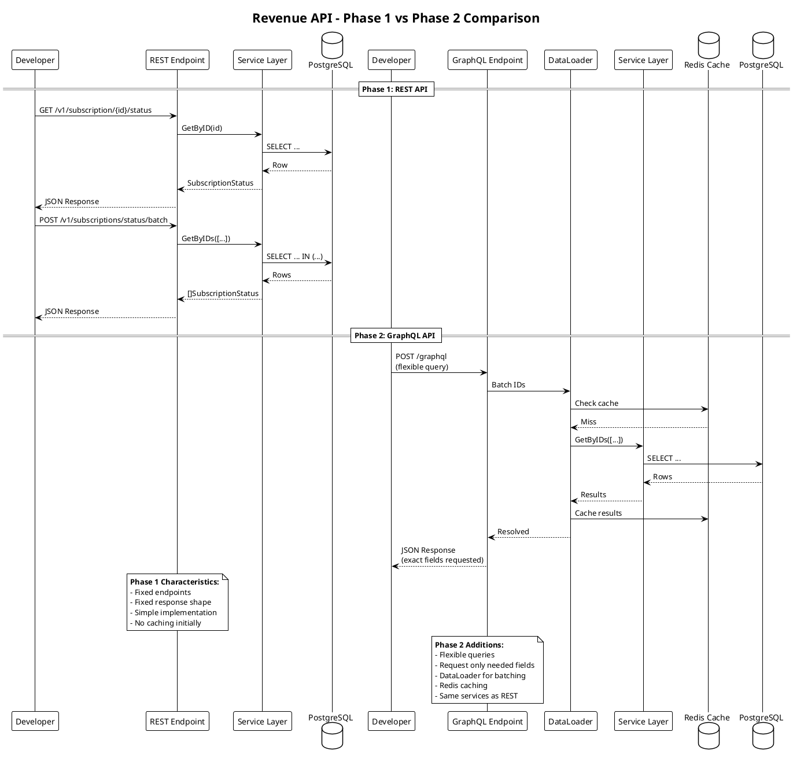

# Feature Discussion – LedgerGuard

Track feature discussions and planning before implementation.

---

## Current Status

### Implemented
- Authentication (Firebase Auth, Google Sign-In)
- Partner Integration (OAuth, Manual Token)
- App Selection
- Executive Dashboard (KPIs, Time Filtering, Delta Comparison)
- Risk Breakdown Page
- Subscription List & Detail
- AI Insight Card (Pro tier)
- Notification Settings
- Profile Page
- Mobile Responsive Layouts

### Pending from Plan
- Dashboard "View All" button (risk breakdown → subscription list)

---

## Feature Discussion Log

### Session: 2026-02-27

**Topic:** Revenue API (External Access Layer)

**Overview:**
New module allowing Shopify app developers to query subscription payment status and usage billing status via API.

**Phased Approach:**
- **Phase 1:** REST API (MVP) - Implement fully
- **Phase 2:** GraphQL (future-ready) - Structure only, no implementation

---

## Revenue API Specification

### Architecture Rules

1. Follow Clean Architecture (Go backend)
2. Do NOT mix core ledger DB with external API read logic
3. Implement CQRS-style read model
4. REST now, GraphQL-ready later
5. Update all documentation (PRD, TAD, DATABASE_SCHEMA, DECISIONS, TEST_PLAN, future.md, PlantUML diagrams)

### Phase 1 Implementation Steps

#### Step 1: Database Extension

**New Tables:**

```sql
-- API Keys for external access
api_keys (
    id UUID PRIMARY KEY,
    user_id UUID NOT NULL REFERENCES users(id),
    key_hash VARCHAR(64) NOT NULL,  -- SHA-256 hash
    name VARCHAR(100),              -- User-friendly name
    created_at TIMESTAMP NOT NULL,
    revoked_at TIMESTAMP,
    rate_limit_per_minute INT DEFAULT 60
)

-- Read model: Subscription status (CQRS)
api_subscription_status (
    subscription_id UUID PRIMARY KEY,
    app_id UUID NOT NULL,
    myshopify_domain VARCHAR(255) NOT NULL,
    risk_state VARCHAR(50) NOT NULL,
    is_paid_current_cycle BOOLEAN NOT NULL,
    expected_next_charge_date TIMESTAMP,
    last_synced_at TIMESTAMP NOT NULL
)

-- Read model: Usage billing status (CQRS)
api_usage_status (
    app_usage_record_id UUID PRIMARY KEY,
    subscription_id UUID NOT NULL,
    billed BOOLEAN NOT NULL,
    billing_date TIMESTAMP,
    amount_cents INT NOT NULL,
    last_synced_at TIMESTAMP NOT NULL
)

-- API Audit Log (separate from core ledger)
api_audit_log (
    id UUID PRIMARY KEY,
    api_key_id UUID NOT NULL REFERENCES api_keys(id),
    endpoint VARCHAR(255) NOT NULL,
    method VARCHAR(10) NOT NULL,
    request_params JSONB,
    response_status INT NOT NULL,
    response_time_ms INT NOT NULL,
    ip_address VARCHAR(45),
    user_agent TEXT,
    created_at TIMESTAMP NOT NULL DEFAULT NOW()
)
```

#### Step 2: Read Model Population

**Service:** `RevenueReadModelBuilder`

- Triggered after every ledger rebuild
- Populates `api_subscription_status` and `api_usage_status`
- Uses existing ledger state (NO Shopify re-sync)
- Idempotent operation

#### Step 3: API Key System

**Endpoints:**
```
POST   /api/v1/api-keys         (OWNER only) - Create key
GET    /api/v1/api-keys         (OWNER only) - List keys
DELETE /api/v1/api-keys/{id}    (OWNER only) - Revoke key
```

**Security:**
- Store only hashed keys (SHA-256)
- Return raw key ONLY at creation (one-time)
- Implement `X-API-KEY` header validation middleware
- Attach user context from key
- Enforce per-key rate limiting

#### Step 4: REST Endpoints

**Subscription Status:**
```
GET /v1/subscription/{subscription_id}/status

Response:
{
    "subscription_id": "uuid",
    "risk_state": "SAFE|ONE_CYCLE_MISSED|TWO_CYCLES_MISSED|CHURNED",
    "is_paid_current_cycle": true,
    "expected_next_charge_date": "2024-03-15T00:00:00Z"
}
```

**Usage Status:**
```
GET /v1/usage/{usage_id}/status

Response:
{
    "usage_id": "uuid",
    "billed": true,
    "billing_date": "2024-02-28T00:00:00Z",
    "amount_cents": 1500
}
```

**Batch Subscription Status:**
```
POST /v1/subscriptions/status/batch

Request:
{
    "subscription_ids": ["uuid1", "uuid2", "uuid3"]
}

Response:
{
    "results": [
        {
            "subscription_id": "uuid1",
            "risk_state": "SAFE",
            "is_paid_current_cycle": true,
            "expected_next_charge_date": "2024-03-15T00:00:00Z"
        },
        ...
    ],
    "not_found": ["uuid3"]
}
```

**Batch Usage Status:**
```
POST /v1/usage/status/batch

Request:
{
    "usage_ids": ["uuid1", "uuid2"]
}

Response:
{
    "results": [
        {
            "usage_id": "uuid1",
            "billed": true,
            "billing_date": "2024-02-28T00:00:00Z",
            "amount_cents": 1500
        },
        ...
    ],
    "not_found": []
}
```

**Rules:**
- Tenant isolation (user can only access their own app data)
- Return 404 if not found or unauthorized (single queries)
- Batch queries return `not_found` array for missing IDs
- Batch limit: 100 IDs per request
- Rate limiting enforced

#### Step 5: Security

- Per-key rate limiting middleware
- Audit log for API usage
- Mask sensitive internal fields
- Integration tests for all scenarios

#### Step 6: Documentation Updates

| Document | Updates |
|----------|---------|
| PRD.md | Add Revenue API module (Pro/Enterprise tier) |
| TAD.md | Add Revenue API Layer + CQRS read model |
| DATABASE_SCHEMA.md | Add new tables |
| DECISIONS.md | ADR for CQRS pattern, API key security |
| TEST_PLAN.md | Add Revenue API test scenarios |
| future.md | GraphQL Phase 2 plan |
| C4.puml | Add Revenue API component |
| ER.puml | Add api_keys, api_subscription_status, api_usage_status |
| SEQUENCE.puml | Add Developer → Revenue API → Read Model flow |

### Phase 2: GraphQL (Future - DO NOT IMPLEMENT)

**Add to future.md:**
- GraphQL endpoint `/graphql`
- Uses read-model tables only
- Schema:
  - `subscription(id)` - Single subscription status
  - `usage(id)` - Single usage status
  - `subscriptions(filter)` - Filtered list
  - `usageRecords(filter)` - Filtered list

**Prepare structure:**
- Create placeholder: `internal/revenue_api/graphql/` (empty)
- REST handlers call application layer services
- GraphQL resolvers will reuse same services later

### Test Requirements

| Test Category | Scenarios |
|---------------|-----------|
| API Key | Creation, validation, revocation |
| Rate Limiting | Enforcement, per-key limits |
| Subscription Status | Success, not found, unauthorized |
| Usage Status | Success, not found, unauthorized |
| Tenant Isolation | Cross-user access denied |
| Read Model | Population after ledger rebuild |

### Directory Structure (Proposed)

```
internal/
├── revenue_api/
│   ├── application/
│   │   └── service/
│   │       ├── subscription_status_service.go
│   │       ├── usage_status_service.go
│   │       └── api_key_service.go
│   ├── domain/
│   │   ├── entity/
│   │   │   ├── api_key.go
│   │   │   ├── subscription_status.go
│   │   │   └── usage_status.go
│   │   └── repository/
│   │       ├── api_key_repository.go
│   │       ├── subscription_status_repository.go
│   │       └── usage_status_repository.go
│   ├── infrastructure/
│   │   └── persistence/
│   │       ├── api_key_repository.go
│   │       ├── subscription_status_repository.go
│   │       └── usage_status_repository.go
│   ├── interfaces/
│   │   └── http/
│   │       ├── handler/
│   │       │   ├── api_key_handler.go
│   │       │   ├── subscription_status_handler.go
│   │       │   └── usage_status_handler.go
│   │       └── middleware/
│   │           ├── api_key_auth.go
│   │           └── rate_limiter.go
│   └── graphql/              # Phase 2 placeholder (empty)
```

---

## Questions Before Implementation

1. **Rate Limiting Strategy:** In-memory (Redis) or database-backed? → **Redis**
2. **Audit Log Table:** Separate table or append to existing logs? → **Separate table** (better for CQRS separation, easier analytics)
3. **API Versioning:** Path-based (`/v1/`) confirmed? → **Yes**
4. **Key Rotation:** Should we support key rotation or just revoke+create? → **Revoke + create new**
5. **Batch Queries:** Allow batch subscription/usage lookups in Phase 1? → **Yes, allow**

---

## Decision Log

| Date | Decision | Rationale |
|------|----------|-----------|
| 2026-02-27 | CQRS read model | Separate read concerns from write ledger |
| 2026-02-27 | Phased approach (REST → GraphQL) | MVP fast, future-ready |
| 2026-02-27 | Hashed API keys only | Security best practice |
| 2026-02-27 | Redis for rate limiting | Distributed, fast, supports TTL natively |
| 2026-02-27 | Separate api_audit_log table | CQRS separation, easier API analytics |
| 2026-02-27 | No key rotation | Simpler MVP, revoke+create sufficient |
| 2026-02-27 | Batch queries in Phase 1 | Developer convenience, reduce API calls |
| 2026-02-27 | Separate PUML files for Revenue API | Clean separation, easier maintenance |
| 2026-02-27 | Revenue API as separate container | Physical isolation from core API |
| 2026-02-27 | Redis in C4 + Sequence diagrams | Full visibility of rate limiting flow |
| 2026-02-27 | Read model population as separate flow | Clear trigger point after ledger rebuild |

---

## PlantUML Diagram Specifications

### New Files to Create

| File | Description |
|------|-------------|
| `docs/C4_revenue_api.puml` | Container + Component diagram (Phase 1 + 2) |
| `docs/ER_revenue_api.puml` | Entity relationships for API tables |
| `docs/SEQUENCE_revenue_api.puml` | All Revenue API flows (Phase 1 + 2) |

---

### C4_revenue_api.puml

#### Phase 1: REST API (Container Level)

```plantuml
@startuml C4_Revenue_API_Phase1_Container
!include https://raw.githubusercontent.com/plantuml-stdlib/C4-PlantUML/master/C4_Container.puml

title LedgerGuard - Revenue API Phase 1: REST (Container Diagram)

' ============================================
' ACTORS
' ============================================
Person(owner, "App Owner", "LedgerGuard user\nManages API keys via dashboard")
Person_Ext(ext_developer, "External Developer", "Shopify app developer\nQueries payment status programmatically")

' ============================================
' EXTERNAL SYSTEMS
' ============================================
System_Ext(shopify_app, "Developer's Shopify App", "Server-side code calling\nRevenue API endpoints")
System_Ext(firebase, "Firebase Auth", "Token verification\nfor dashboard users")

' ============================================
' LEDGERGUARD PLATFORM
' ============================================
System_Boundary(ledgerguard, "LedgerGuard Platform") {

    ' --- Core API (Existing) ---
    Container(core_api, "Core API Server", "Go 1.22+, Chi Router", "Dashboard API\nSync orchestration\nLedger management\nAPI key CRUD")

    ' --- Revenue API (New - Phase 1) ---
    Container(revenue_api, "Revenue API Server", "Go 1.22+, Chi Router", "External status queries\nREST endpoints\nRate limiting\nAudit logging")

    ' --- Databases ---
    ContainerDb(postgres_core, "PostgreSQL\n(Core Ledger)", "Primary database", "users, partner_accounts\napps, transactions\nsubscriptions\ndaily_metrics_snapshot")

    ContainerDb(postgres_read, "PostgreSQL\n(CQRS Read Model)", "Read-optimized views", "api_keys\napi_subscription_status\napi_usage_status\napi_audit_log")

    ContainerDb(redis, "Redis", "In-memory cache", "Rate limit counters\nKey: {api_key_id}:minute\nTTL: 60 seconds")
}

' ============================================
' RELATIONSHIPS
' ============================================

' Owner interactions
Rel(owner, core_api, "Firebase Auth\n/api/v1/api-keys", "HTTPS")

' External developer interactions
Rel(ext_developer, shopify_app, "Integrates SDK")
Rel(shopify_app, revenue_api, "X-API-KEY header", "HTTPS/REST")

' Core API relationships
Rel(core_api, firebase, "Verify ID token", "HTTPS")
Rel(core_api, postgres_core, "Read/Write ledger", "SQL/TLS")
Rel(core_api, postgres_read, "Populate read model\n(after ledger rebuild)", "SQL/TLS")

' Revenue API relationships
Rel(revenue_api, redis, "Rate limit check\nINCR + EXPIRE", "TCP")
Rel(revenue_api, postgres_read, "Query status\nLog audit", "SQL/TLS")

SHOW_LEGEND()

note right of revenue_api
  **Phase 1 Endpoints:**
  GET  /v1/subscription/{id}/status
  GET  /v1/usage/{id}/status
  POST /v1/subscriptions/status/batch
  POST /v1/usage/status/batch
end note

note right of postgres_read
  **CQRS Pattern:**
  - Separate from write model
  - Denormalized for queries
  - Updated after sync
end note

@enduml
```

#### Phase 2: GraphQL Addition (Container Level)

```plantuml
@startuml C4_Revenue_API_Phase2_Container
!include https://raw.githubusercontent.com/plantuml-stdlib/C4-PlantUML/master/C4_Container.puml

title LedgerGuard - Revenue API Phase 2: REST + GraphQL (Container Diagram)

' ============================================
' ACTORS
' ============================================
Person(owner, "App Owner", "LedgerGuard user")
Person_Ext(ext_developer, "External Developer", "Shopify app developer")

' ============================================
' EXTERNAL SYSTEMS
' ============================================
System_Ext(shopify_app, "Developer's Shopify App", "Calls REST or GraphQL")
System_Ext(firebase, "Firebase Auth", "Dashboard auth")

' ============================================
' LEDGERGUARD PLATFORM
' ============================================
System_Boundary(ledgerguard, "LedgerGuard Platform") {

    ' --- Core API (Existing) ---
    Container(core_api, "Core API Server", "Go 1.22+", "Dashboard API\nAPI key management")

    ' --- Revenue API (Phase 2 - Dual Protocol) ---
    Container(revenue_api, "Revenue API Server", "Go 1.22+", "REST endpoints (Phase 1)\nGraphQL endpoint (Phase 2)\nShared application services")

    ' --- Databases ---
    ContainerDb(postgres_core, "PostgreSQL\n(Core Ledger)", "Primary database", "Core tables")

    ContainerDb(postgres_read, "PostgreSQL\n(CQRS Read Model)", "Read-optimized", "Status tables\nAudit log")

    ContainerDb(redis, "Redis", "Cache", "Rate limits\nQuery cache (Phase 2)")
}

' ============================================
' RELATIONSHIPS
' ============================================

Rel(owner, core_api, "Firebase Auth", "HTTPS")
Rel(ext_developer, shopify_app, "Integrates")

Rel(shopify_app, revenue_api, "REST: /v1/*\nGraphQL: /graphql", "HTTPS")

Rel(core_api, firebase, "Verify token", "HTTPS")
Rel(core_api, postgres_core, "Write", "SQL")
Rel(core_api, postgres_read, "Populate", "SQL")

Rel(revenue_api, redis, "Rate limit\nQuery cache", "TCP")
Rel(revenue_api, postgres_read, "Query", "SQL")

SHOW_LEGEND()

note right of revenue_api
  **Phase 2 Additions:**
  POST /graphql

  **GraphQL Schema:**
  - subscription(id): SubscriptionStatus
  - usage(id): UsageStatus
  - subscriptions(filter): [SubscriptionStatus]
  - usageRecords(filter): [UsageStatus]

  **Shared Services:**
  - SubscriptionStatusService
  - UsageStatusService
  - Both REST & GraphQL use same services
end note

@enduml
```

---

### C4_revenue_api_components.puml

#### Phase 1: REST Components

```plantuml
@startuml C4_Revenue_API_Phase1_Components
!include https://raw.githubusercontent.com/plantuml-stdlib/C4-PlantUML/master/C4_Component.puml

title Revenue API - Phase 1: REST Components

' ============================================
' EXTERNAL DEPENDENCIES
' ============================================
ContainerDb_Ext(redis, "Redis", "Rate limit counters")
ContainerDb_Ext(postgres, "PostgreSQL", "Read model tables")
Container_Ext(core_api, "Core API", "Populates read model")

' ============================================
' REVENUE API CONTAINER
' ============================================
Container_Boundary(revenue_api, "Revenue API Server") {

    ' --- INTERFACES LAYER ---
    rectangle "Interfaces Layer" <<boundary>> {
        Component(router, "Chi Router", "HTTP Router", "Route registration\nMiddleware chain")

        rectangle "Middleware Chain" <<boundary>> {
            Component(apikey_auth_mw, "ApiKeyAuthMiddleware", "Middleware", "1. Extract X-API-KEY\n2. Hash & lookup\n3. Validate not revoked\n4. Attach user context")
            Component(rate_limiter_mw, "RateLimiterMiddleware", "Middleware", "1. Get key's limit\n2. Redis INCR\n3. Check threshold\n4. Return 429 or continue")
            Component(audit_mw, "AuditMiddleware", "Middleware", "Log request/response\nCapture timing")
        }

        rectangle "REST Handlers" <<boundary>> {
            Component(sub_status_handler, "SubscriptionStatusHandler", "Handler", "GET /v1/subscription/{id}/status\nPOST /v1/subscriptions/status/batch")
            Component(usage_status_handler, "UsageStatusHandler", "Handler", "GET /v1/usage/{id}/status\nPOST /v1/usage/status/batch")
        }
    }

    ' --- APPLICATION LAYER ---
    rectangle "Application Layer" <<boundary>> {
        Component(sub_status_service, "SubscriptionStatusService", "Service", "GetByID(subscriptionID)\nGetByIDs([]subscriptionID)\nValidateTenantAccess()")
        Component(usage_status_service, "UsageStatusService", "Service", "GetByID(usageID)\nGetByIDs([]usageID)\nValidateTenantAccess()")
        Component(apikey_service, "ApiKeyService", "Service", "Create(userID, name)\nValidate(keyHash)\nRevoke(keyID)\nList(userID)")
    }

    ' --- DOMAIN LAYER ---
    rectangle "Domain Layer" <<boundary>> {
        Component(sub_status_entity, "SubscriptionStatus", "Entity", "subscriptionID: UUID\nappID: UUID\nmyshopifyDomain: string\nriskState: RiskState\nisPaidCurrentCycle: bool\nexpectedNextCharge: time")
        Component(usage_status_entity, "UsageStatus", "Entity", "usageRecordID: UUID\nsubscriptionID: UUID\nbilled: bool\nbillingDate: time\namountCents: int")
        Component(apikey_entity, "ApiKey", "Entity", "id: UUID\nuserID: UUID\nkeyHash: string\nname: string\nrateLimitPerMin: int\ncreatedAt: time\nrevokedAt: time")

        Component(sub_status_repo_if, "SubscriptionStatusRepository", "Interface", "GetByID(id) → Status\nGetByIDs(ids) → []Status\nGetByAppID(appID) → []Status\nUpsert(status)")
        Component(usage_status_repo_if, "UsageStatusRepository", "Interface", "GetByID(id) → Status\nGetByIDs(ids) → []Status\nUpsert(status)")
        Component(apikey_repo_if, "ApiKeyRepository", "Interface", "Create(key)\nGetByHash(hash)\nGetByUserID(userID)\nRevoke(id)")
        Component(audit_repo_if, "AuditLogRepository", "Interface", "Log(entry)")
    }

    ' --- INFRASTRUCTURE LAYER ---
    rectangle "Infrastructure Layer" <<boundary>> {
        Component(sub_status_repo, "PostgresSubscriptionStatusRepo", "Repository", "Implements interface\nSQL queries")
        Component(usage_status_repo, "PostgresUsageStatusRepo", "Repository", "Implements interface\nSQL queries")
        Component(apikey_repo, "PostgresApiKeyRepo", "Repository", "Implements interface\nSQL queries")
        Component(audit_repo, "PostgresAuditLogRepo", "Repository", "Implements interface\nAsync insert")
        Component(rate_limiter, "RedisRateLimiter", "Adapter", "INCR with TTL\nSliding window")
    }
}

' ============================================
' RELATIONSHIPS
' ============================================

' Router to Middleware Chain
Rel_D(router, apikey_auth_mw, "1")
Rel_D(apikey_auth_mw, rate_limiter_mw, "2")
Rel_D(rate_limiter_mw, audit_mw, "3")

' Middleware to Handlers
Rel_D(audit_mw, sub_status_handler, "/v1/subscription/*")
Rel_D(audit_mw, usage_status_handler, "/v1/usage/*")

' Handlers to Services
Rel_D(sub_status_handler, sub_status_service, "Uses")
Rel_D(usage_status_handler, usage_status_service, "Uses")
Rel_D(apikey_auth_mw, apikey_service, "Validate")

' Services to Repositories (via interfaces)
Rel_D(sub_status_service, sub_status_repo_if, "Uses")
Rel_D(usage_status_service, usage_status_repo_if, "Uses")
Rel_D(apikey_service, apikey_repo_if, "Uses")
Rel_D(audit_mw, audit_repo_if, "Logs")

' Interface to Implementation
Rel_D(sub_status_repo_if, sub_status_repo, "Implemented by")
Rel_D(usage_status_repo_if, usage_status_repo, "Implemented by")
Rel_D(apikey_repo_if, apikey_repo, "Implemented by")
Rel_D(audit_repo_if, audit_repo, "Implemented by")

' Infrastructure to External
Rel_D(sub_status_repo, postgres, "SQL")
Rel_D(usage_status_repo, postgres, "SQL")
Rel_D(apikey_repo, postgres, "SQL")
Rel_D(audit_repo, postgres, "SQL")
Rel_D(rate_limiter, redis, "INCR/GET")
Rel_D(rate_limiter_mw, rate_limiter, "Uses")

' Core API populates read model
Rel(core_api, postgres, "Populate after\nledger rebuild")

SHOW_LEGEND()
@enduml
```

#### Phase 2: GraphQL Addition (Components)

```plantuml
@startuml C4_Revenue_API_Phase2_Components
!include https://raw.githubusercontent.com/plantuml-stdlib/C4-PlantUML/master/C4_Component.puml

title Revenue API - Phase 2: REST + GraphQL Components

' ============================================
' EXTERNAL DEPENDENCIES
' ============================================
ContainerDb_Ext(redis, "Redis", "Rate limits + Query cache")
ContainerDb_Ext(postgres, "PostgreSQL", "Read model")

' ============================================
' REVENUE API CONTAINER
' ============================================
Container_Boundary(revenue_api, "Revenue API Server") {

    ' --- INTERFACES LAYER ---
    rectangle "Interfaces Layer" <<boundary>> {
        Component(router, "Chi Router", "HTTP Router", "Route registration")

        rectangle "Shared Middleware" <<boundary>> {
            Component(apikey_auth_mw, "ApiKeyAuthMiddleware", "Middleware", "X-API-KEY validation")
            Component(rate_limiter_mw, "RateLimiterMiddleware", "Middleware", "Per-key rate limiting")
            Component(audit_mw, "AuditMiddleware", "Middleware", "Request logging")
        }

        rectangle "REST Handlers (Phase 1)" <<boundary>> #LightGreen {
            Component(sub_status_handler, "SubscriptionStatusHandler", "Handler", "GET/POST /v1/subscription/*")
            Component(usage_status_handler, "UsageStatusHandler", "Handler", "GET/POST /v1/usage/*")
        }

        rectangle "GraphQL Layer (Phase 2)" <<boundary>> #LightBlue {
            Component(graphql_handler, "GraphQLHandler", "Handler", "POST /graphql")
            Component(graphql_schema, "GraphQL Schema", "gqlgen", "type Query {\n  subscription(id)\n  usage(id)\n  subscriptions(filter)\n  usageRecords(filter)\n}")
            Component(sub_resolver, "SubscriptionResolver", "Resolver", "Resolves subscription queries")
            Component(usage_resolver, "UsageResolver", "Resolver", "Resolves usage queries")
            Component(dataloader, "DataLoader", "Batching", "N+1 query prevention\nBatched lookups")
        }
    }

    ' --- APPLICATION LAYER (SHARED) ---
    rectangle "Application Layer (Shared)" <<boundary>> #LightYellow {
        Component(sub_status_service, "SubscriptionStatusService", "Service", "Used by REST & GraphQL")
        Component(usage_status_service, "UsageStatusService", "Service", "Used by REST & GraphQL")
        Component(apikey_service, "ApiKeyService", "Service", "Key management")
    }

    ' --- DOMAIN LAYER ---
    rectangle "Domain Layer" <<boundary>> {
        Component(entities, "Entities", "Domain", "SubscriptionStatus\nUsageStatus\nApiKey")
        Component(repos_if, "Repository Interfaces", "Ports", "Contracts for persistence")
    }

    ' --- INFRASTRUCTURE LAYER ---
    rectangle "Infrastructure Layer" <<boundary>> {
        Component(repos, "PostgreSQL Repositories", "Adapters", "Implementation")
        Component(cache, "Redis Cache", "Adapter", "Query caching (Phase 2)")
    }
}

' ============================================
' RELATIONSHIPS
' ============================================

' Middleware chain
Rel_D(router, apikey_auth_mw, "All /v1/* and /graphql")
Rel_D(apikey_auth_mw, rate_limiter_mw, "→")
Rel_D(rate_limiter_mw, audit_mw, "→")

' REST path
Rel_D(audit_mw, sub_status_handler, "REST")
Rel_D(audit_mw, usage_status_handler, "REST")

' GraphQL path
Rel_D(audit_mw, graphql_handler, "GraphQL")
Rel_D(graphql_handler, graphql_schema, "Execute")
Rel_D(graphql_schema, sub_resolver, "Resolve")
Rel_D(graphql_schema, usage_resolver, "Resolve")
Rel_D(sub_resolver, dataloader, "Batch")
Rel_D(usage_resolver, dataloader, "Batch")

' Both REST and GraphQL use same services
Rel_D(sub_status_handler, sub_status_service, "Uses")
Rel_D(usage_status_handler, usage_status_service, "Uses")
Rel_D(dataloader, sub_status_service, "Uses")
Rel_D(dataloader, usage_status_service, "Uses")

' Services to repos
Rel_D(sub_status_service, repos_if, "Uses")
Rel_D(usage_status_service, repos_if, "Uses")
Rel_D(repos_if, repos, "Implements")

' Infrastructure
Rel_D(repos, postgres, "SQL")
Rel_D(cache, redis, "GET/SET")
Rel_D(sub_status_service, cache, "Cache check")

SHOW_LEGEND()

note right of graphql_schema
  **GraphQL Schema (Phase 2):**

  type SubscriptionStatus {
    subscriptionId: ID!
    appId: ID!
    myshopifyDomain: String!
    riskState: RiskState!
    isPaidCurrentCycle: Boolean!
    expectedNextChargeDate: DateTime
  }

  type UsageStatus {
    usageId: ID!
    subscriptionId: ID!
    billed: Boolean!
    billingDate: DateTime
    amountCents: Int!
  }

  type Query {
    subscription(id: ID!): SubscriptionStatus
    usage(id: ID!): UsageStatus
    subscriptions(
      appId: ID
      riskState: RiskState
      limit: Int = 50
      offset: Int = 0
    ): [SubscriptionStatus!]!
    usageRecords(
      subscriptionId: ID
      billed: Boolean
      limit: Int = 50
      offset: Int = 0
    ): [UsageStatus!]!
  }

  enum RiskState {
    SAFE
    ONE_CYCLE_MISSED
    TWO_CYCLES_MISSED
    CHURNED
  }
end note

note bottom of dataloader
  **DataLoader (Phase 2):**
  - Batches multiple subscription(id)
    calls into single SQL query
  - Prevents N+1 problem
  - Per-request caching
end note

@enduml
```

---

### ER_revenue_api.puml

```plantuml
@startuml ER_Revenue_API
!theme plain
skinparam linetype ortho

title Revenue API - Entity Relationship Diagram (Phase 1 + Phase 2)

' ============================================
' EXISTING TABLES (Reference)
' ============================================

entity "users" as users <<existing>> #LightGray {
  *id : UUID <<PK>>
  --
  firebase_uid : VARCHAR(128)
  email : VARCHAR(255)
  role : VARCHAR(20)
  plan_tier : VARCHAR(20)
}

entity "apps" as apps <<existing>> #LightGray {
  *id : UUID <<PK>>
  --
  partner_account_id : UUID <<FK>>
  partner_app_id : VARCHAR(100)
  name : VARCHAR(255)
}

entity "subscriptions" as subscriptions <<existing>> #LightGray {
  *id : UUID <<PK>>
  --
  app_id : UUID <<FK>>
  shopify_gid : VARCHAR(255)
  myshopify_domain : VARCHAR(255)
  risk_state : VARCHAR(30)
  status : VARCHAR(20)
}

' ============================================
' NEW TABLES - PHASE 1
' ============================================

entity "api_keys" as api_keys #LightGreen {
  *id : UUID <<PK>>
  --
  *user_id : UUID <<FK users>>
  *key_hash : VARCHAR(64)
  name : VARCHAR(100)
  *rate_limit_per_minute : INT
  *created_at : TIMESTAMPTZ
  revoked_at : TIMESTAMPTZ
  ==
  **Constraints:**
  DEFAULT rate_limit = 60
  CHECK rate_limit BETWEEN 1 AND 1000
  ==
  **Indexes:**
  idx_api_keys_user_id (user_id)
  idx_api_keys_hash UNIQUE (key_hash)
  idx_api_keys_active (user_id) WHERE revoked_at IS NULL
}

entity "api_audit_log" as api_audit_log #LightGreen {
  *id : UUID <<PK>>
  --
  *api_key_id : UUID <<FK api_keys>>
  *endpoint : VARCHAR(255)
  *method : VARCHAR(10)
  request_params : JSONB
  *response_status : INT
  *response_time_ms : INT
  ip_address : VARCHAR(45)
  user_agent : TEXT
  *created_at : TIMESTAMPTZ
  ==
  **Indexes:**
  idx_audit_key_created (api_key_id, created_at DESC)
  idx_audit_created (created_at DESC)
  idx_audit_status (response_status) WHERE response_status >= 400
  ==
  **Partitioning (optional):**
  PARTITION BY RANGE (created_at)
  Retention: 90 days
}

entity "api_subscription_status" as api_sub_status #LightGreen {
  *subscription_id : UUID <<PK>>
  --
  *app_id : UUID
  *myshopify_domain : VARCHAR(255)
  *risk_state : VARCHAR(30)
  *is_paid_current_cycle : BOOLEAN
  expected_next_charge_date : TIMESTAMPTZ
  *last_synced_at : TIMESTAMPTZ
  ==
  **Constraints:**
  CHECK risk_state IN ('SAFE','ONE_CYCLE_MISSED','TWO_CYCLES_MISSED','CHURNED')
  ==
  **Indexes:**
  idx_sub_status_app (app_id)
  idx_sub_status_risk (app_id, risk_state)
  idx_sub_status_domain (myshopify_domain)
  idx_sub_status_sync (last_synced_at)
}

entity "api_usage_status" as api_usage_status #LightGreen {
  *app_usage_record_id : UUID <<PK>>
  --
  *subscription_id : UUID
  *billed : BOOLEAN
  billing_date : TIMESTAMPTZ
  *amount_cents : INT
  *last_synced_at : TIMESTAMPTZ
  ==
  **Constraints:**
  CHECK amount_cents >= 0
  ==
  **Indexes:**
  idx_usage_subscription (subscription_id)
  idx_usage_billed (subscription_id, billed)
  idx_usage_sync (last_synced_at)
}

' ============================================
' PHASE 2 ADDITIONS (Future)
' ============================================

entity "api_query_cache" as api_query_cache <<Phase 2>> #LightBlue {
  *cache_key : VARCHAR(255) <<PK>>
  --
  *query_hash : VARCHAR(64)
  *result_json : JSONB
  *created_at : TIMESTAMPTZ
  *expires_at : TIMESTAMPTZ
  ==
  **Note:** Alternative to Redis
  For simpler deployments
  ==
  **Indexes:**
  idx_cache_expires (expires_at)
}

entity "api_rate_limit_override" as api_rate_override <<Phase 2>> #LightBlue {
  *id : UUID <<PK>>
  --
  *api_key_id : UUID <<FK api_keys>>
  *endpoint_pattern : VARCHAR(255)
  *custom_limit : INT
  *created_at : TIMESTAMPTZ
  ==
  **Note:** Per-endpoint limits
  e.g., /graphql = 30/min
  ==
  **Indexes:**
  idx_override_key (api_key_id)
}

' ============================================
' RELATIONSHIPS
' ============================================

users ||--o{ api_keys : "owns"
api_keys ||--o{ api_audit_log : "generates"
api_keys ||--o{ api_rate_override : "has overrides"

' Read model relationships (logical, not FK)
apps ..> api_sub_status : "populated from"
subscriptions ..> api_sub_status : "source"
api_sub_status ||--o{ api_usage_status : "has usage"

' ============================================
' NOTES
' ============================================

note right of api_keys
  **API Key Security:**
  - key_hash = SHA256(raw_key)
  - Raw key shown ONLY at creation
  - Prefix: "lgk_" (LedgerGuard Key)
  - Length: 32 bytes (256 bits)

  **Lifecycle:**
  - Created: revoked_at = NULL
  - Revoked: revoked_at = timestamp
  - No rotation, create new + revoke old
end note

note right of api_sub_status
  **CQRS Read Model:**
  - Denormalized for fast queries
  - No JOINs needed for status check
  - Updated synchronously after sync

  **is_paid_current_cycle:**
  - TRUE if status = 'ACTIVE'
  - Simplified billing check
end note

note right of api_audit_log
  **Audit Trail:**
  - Every API call logged
  - Used for debugging & analytics
  - Compliance requirement

  **Query Examples:**
  - Errors by endpoint
  - Latency percentiles
  - Usage by API key
end note

note bottom of api_query_cache
  **Phase 2 Only:**
  - GraphQL query caching
  - Alternative to Redis
  - Auto-cleanup via expires_at
end note

@enduml
```



---

### ER Diagram - Detailed Field Descriptions

| Table | Field | Type | Description |
|-------|-------|------|-------------|
| **api_keys** | id | UUID | Primary key |
| | user_id | UUID | Owner of the key (FK → users) |
| | key_hash | VARCHAR(64) | SHA-256 hash of raw API key |
| | name | VARCHAR(100) | User-friendly name (e.g., "Production") |
| | rate_limit_per_minute | INT | Requests allowed per minute (default: 60) |
| | created_at | TIMESTAMPTZ | Creation timestamp |
| | revoked_at | TIMESTAMPTZ | Revocation timestamp (NULL = active) |
| **api_audit_log** | id | UUID | Primary key |
| | api_key_id | UUID | Which key made the request |
| | endpoint | VARCHAR(255) | e.g., "/v1/subscription/abc/status" |
| | method | VARCHAR(10) | GET, POST, etc. |
| | request_params | JSONB | Query params or body (sanitized) |
| | response_status | INT | HTTP status code |
| | response_time_ms | INT | Request duration in milliseconds |
| | ip_address | VARCHAR(45) | Client IP (IPv4 or IPv6) |
| | user_agent | TEXT | Client user agent string |
| | created_at | TIMESTAMPTZ | Request timestamp |
| **api_subscription_status** | subscription_id | UUID | PK, matches subscriptions.id |
| | app_id | UUID | For tenant isolation queries |
| | myshopify_domain | VARCHAR(255) | Store domain for lookups |
| | risk_state | VARCHAR(30) | SAFE, ONE_CYCLE_MISSED, etc. |
| | is_paid_current_cycle | BOOLEAN | Quick payment status check |
| | expected_next_charge_date | TIMESTAMPTZ | When next payment expected |
| | last_synced_at | TIMESTAMPTZ | When read model was updated |
| **api_usage_status** | app_usage_record_id | UUID | PK, matches usage records |
| | subscription_id | UUID | Parent subscription |
| | billed | BOOLEAN | Has billing transaction occurred? |
| | billing_date | TIMESTAMPTZ | When billed (if billed) |
| | amount_cents | INT | Usage charge amount |
| | last_synced_at | TIMESTAMPTZ | When read model was updated |

---

### SEQUENCE_revenue_api.puml (Detailed Flows)

---

#### Flow 1: API Key Creation (Phase 1)



---

#### Flow 2: API Key Authentication & Rate Limiting (Phase 1)



---

#### Flow 3: Subscription Status Query - Single (Phase 1)



---

#### Flow 4: Subscription Status Query - Batch (Phase 1)



---

#### Flow 5: Read Model Population (Phase 1)



---

#### Flow 6: GraphQL Query (Phase 2 - Future)



---

#### Flow 7: Phase Comparison Summary



---

## Implementation Checklist

### Phase 1: REST Revenue API

- [ ] **Step 1:** Database migration (api_keys, api_subscription_status, api_usage_status)
- [ ] **Step 2:** RevenueReadModelBuilder service
- [ ] **Step 3:** API key management (create, list, revoke)
- [ ] **Step 4:** API key auth middleware + rate limiter
- [ ] **Step 5:** Subscription status endpoint
- [ ] **Step 6:** Usage status endpoint
- [ ] **Step 7:** Integration tests
- [ ] **Step 8:** Documentation updates
- [ ] **Step 9:** Phase 2 placeholder structure

---
