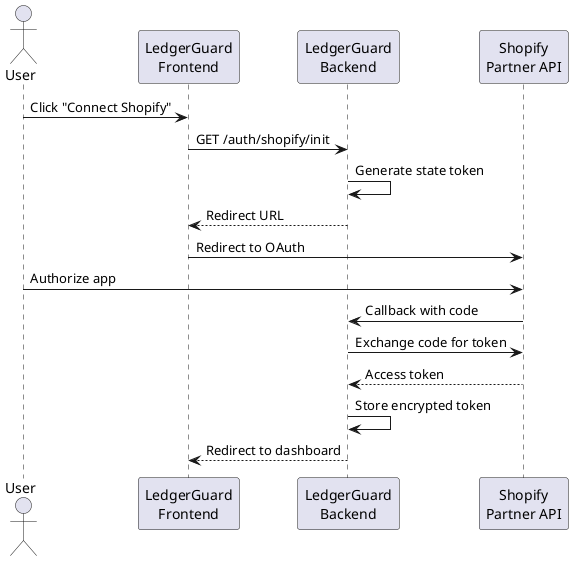

# Comprehensive Review Fixes - Implementation Prompt

## Overview

This document captures all issues identified from reviewing LedgerGuard against Shopify Partner API documentation and best practices. Issues are prioritized by business impact and implementation order.

---

## Priority Legend

| Priority | Description |
|----------|-------------|
| **P0 - Critical** | Incorrect calculations, data integrity issues, security concerns |
| **P1 - High** | Missing core features, architecture gaps |
| **P2 - Medium** | Improvements, optimizations, documentation |
| **P3 - Low** | Nice-to-haves, polish |

---

## P0 - Critical Issues

### 1. Risk Classification Logic Error

**Problem:** Current risk classification only considers days since last charge, but Shopify subscriptions can have `status: ACTIVE` even when payment is pending. The risk engine doesn't check subscription status from Shopify.

**Current Code:**
```go
func ClassifyRisk(expectedNextCharge time.Time, now time.Time) RiskState {
    daysLate := int(now.Sub(expectedNextCharge).Hours() / 24)
    // ... classification based on days only
}
```

**Fix Required:**
```go
func ClassifyRisk(status string, expectedNextCharge time.Time, now time.Time) RiskState {
    // If Shopify says ACTIVE, trust it
    if status == "ACTIVE" {
        return RiskSafe
    }
    // Otherwise use days-based classification
    daysLate := int(now.Sub(expectedNextCharge).Hours() / 24)
    // ...
}
```

**Files to Update:**
- `internal/domain/service/risk_engine.go`
- `internal/domain/service/risk_engine_test.go`
- `internal/application/service/ledger_service.go`

---

### 2. Synthetic GID Generation Non-Compliant

**Problem:** Using `fmt.Sprintf("gid://ledgerguard/...")` for internal IDs mimics Shopify's GID format. This could cause confusion and potential ID collisions.

**Fix Required:**
- Use UUIDs or sequential IDs with clear `lg_` prefix
- Format: `lg_sub_<uuid>` or `lg_txn_<uuid>`

**Files to Update:**
- `internal/domain/entity/subscription.go`
- `internal/infrastructure/persistence/subscription_repository.go`
- Migration to update existing synthetic IDs

---

### 3. MRR Calculation Missing Annual Normalization

**Problem:** Annual subscriptions should contribute `price / 12` to MRR, not full price. Current implementation may not properly normalize billing intervals.

**Fix Required:**
```go
func CalculateMRR(price int64, billingInterval string) int64 {
    switch billingInterval {
    case "ANNUAL":
        return price / 12
    case "MONTHLY":
        return price
    default:
        return price // assume monthly
    }
}
```

**Files to Update:**
- `internal/domain/service/metrics_engine.go`
- `internal/domain/service/metrics_engine_test.go`

---

### 4. Revenue Share Fees Not Calculated

**Problem:** Shopify charges revenue share (0%, 15%, or 20%) plus 2.9% payment processing. Current metrics show gross revenue, not net.

**Shopify Revenue Share Tiers:**
| Annual Earnings | Revenue Share |
|-----------------|---------------|
| $0 - $1M | 0% |
| $1M - $10M | 15% |
| $10M+ | 20% |

**Fix Required:**
- Add `revenue_share_tier` to App entity
- Calculate net revenue: `gross * (1 - share_rate) * (1 - 0.029)`
- Display both gross and net in dashboard

**Files to Update:**
- `internal/domain/entity/app.go`
- `internal/domain/service/metrics_engine.go`
- `frontend/app/lib/domain/entities/app.dart`
- Dashboard KPI cards

---

### 5. Missing Error Handling for API Rate Limits

**Problem:** Shopify Partner API has rate limits (currently 4 requests/second with bucket). No exponential backoff or retry logic implemented.

**Fix Required:**
```go
type ShopifyClient struct {
    rateLimiter *rate.Limiter
    maxRetries  int
}

func (c *ShopifyClient) ExecuteWithRetry(query string) (*Response, error) {
    for attempt := 0; attempt < c.maxRetries; attempt++ {
        c.rateLimiter.Wait(ctx)
        resp, err := c.execute(query)
        if err == nil {
            return resp, nil
        }
        if isRateLimitError(err) {
            time.Sleep(backoff(attempt))
            continue
        }
        return nil, err
    }
    return nil, ErrMaxRetriesExceeded
}
```

**Files to Update:**
- `internal/infrastructure/external/shopify_client.go`
- Add `golang.org/x/time/rate` dependency

---

### 6. Test Coverage Below 80%

**Problem:** Critical domain services lack comprehensive test coverage.

**Required Tests:**
- [ ] Risk engine edge cases (exactly 30, 60, 90 days)
- [ ] Metrics engine with mixed charge types
- [ ] Ledger rebuild idempotency
- [ ] Subscription lifecycle transitions
- [ ] Transaction classification accuracy

**Files to Create/Update:**
- `internal/domain/service/risk_engine_test.go`
- `internal/domain/service/metrics_engine_test.go`
- `internal/application/service/ledger_service_test.go`

---

### 7. GraphQL Query Missing Required Fields

**Problem:** Current transaction query may not fetch all required fields for accurate classification.

**Required Fields:**
```graphql
query FetchTransactions($appId: ID!, $after: String) {
  app(id: $appId) {
    transactions(first: 100, after: $after) {
      edges {
        node {
          id
          type: __typename
          grossAmount { amount currencyCode }
          netAmount { amount currencyCode }
          shop {
            id
            name
            domain
            plan { displayName }
          }
          createdAt
          ... on AppSubscriptionSale {
            appSubscription {
              id
              name
              status
              currentPeriodEnd
              lineItems {
                plan { pricingDetails }
              }
            }
          }
          ... on AppUsageSale {
            appUsageRecord {
              id
              description
            }
          }
        }
      }
      pageInfo {
        hasNextPage
        endCursor
      }
    }
  }
}
```

**Files to Update:**
- `internal/infrastructure/external/shopify_client.go`
- Add fragment definitions for cleaner queries

---

## P1 - High Priority Issues

### 8. No Webhook Integration

**Problem:** Relying solely on 12-hour polling means up to 12-hour delay in detecting churn. Shopify provides webhooks for real-time updates.

**Required Webhooks:**
- `app_subscriptions/update` - Subscription status changes
- `app_uninstalled` - Immediate churn detection
- `shop/update` - Shop plan changes

**Implementation Steps:**
1. Create webhook handler endpoints
2. Register webhooks via Partner API
3. Validate HMAC signatures
4. Process events and update local state
5. Keep polling as fallback

**Files to Create:**
- `internal/interfaces/http/handler/webhook_handler.go`
- `internal/application/service/webhook_service.go`

---

### 9. No Soft Deletes

**Problem:** Hard deletes lose historical data. When a shop uninstalls, we lose ability to track win-back or reactivation.

**Fix Required:**
```sql
ALTER TABLE subscriptions ADD COLUMN deleted_at TIMESTAMP;
ALTER TABLE shops ADD COLUMN deleted_at TIMESTAMP;

-- Update queries to exclude deleted
WHERE deleted_at IS NULL
```

**Files to Update:**
- All repository implementations
- Add `deleted_at` to entities
- Migration script

---

### 10. ER Diagram Mismatches

**Problem:** `docs/ER.puml` doesn't match actual database schema.

**Discrepancies to Fix:**
- Missing `daily_metrics_snapshot` entity
- Missing `sync_logs` table
- Incorrect relationship cardinalities
- Missing indexes documentation

**Files to Update:**
- `docs/ER.puml`
- `docs/ER_current.puml`

---

### 11. Missing Manual Charge Handling

**Problem:** Apps can have one-time charges (setup fees, add-ons). Current system may not properly classify these.

**Fix Required:**
- Ensure `ChargeTypeOneTime` properly tracked
- Exclude from MRR calculations
- Include in total revenue

**Files to Update:**
- `internal/domain/valueobject/charge_type.go`
- `internal/domain/service/metrics_engine.go`

---

### 12. No Subscription Lifecycle Events

**Problem:** Not tracking subscription state transitions (Trial → Active → Cancelled → Churned).

**Fix Required:**
```go
type SubscriptionEvent struct {
    SubscriptionID string
    FromState      string
    ToState        string
    OccurredAt     time.Time
    Reason         string // voluntary, involuntary, etc.
}
```

**Files to Create:**
- `internal/domain/entity/subscription_event.go`
- `internal/domain/repository/subscription_event_repository.go`

---

### 13. No Payment Failure Tracking

**Problem:** Can't distinguish between voluntary churn (user cancelled) and involuntary churn (payment failed).

**Shopify Provides:**
- `billing_attempt_failure` webhook
- Subscription status changes

**Fix Required:**
- Track payment failure events
- Categorize churn as voluntary/involuntary
- Different recovery strategies for each

---

## P2 - Medium Priority Issues

### 14. Dashboard Not Responsive on Mobile

**Problem:** Dashboard KPI cards don't stack properly on mobile devices.

**Fix Required:**
- Use responsive grid layouts
- Collapse navigation on mobile
- Touch-friendly controls

**Files to Update:**
- `frontend/app/lib/presentation/pages/dashboard_page.dart`
- `frontend/app/lib/presentation/widgets/kpi_card.dart`

---

### 15. No Caching Layer

**Problem:** Every dashboard load hits the database. No Redis/memory caching for frequently accessed data.

**Fix Required:**
- Add Redis for session and metrics caching
- Cache daily snapshots (immutable after creation)
- Cache app configurations

---

### 16. Missing API Documentation

**Problem:** No OpenAPI/Swagger spec for REST endpoints.

**Fix Required:**
- Generate OpenAPI 3.0 spec
- Add to `docs/api/`
- Consider API versioning

---

### 17. Sequence Diagrams Incomplete

**Problem:** `docs/SEQUENCE.puml` missing key flows.

**Missing Flows:**
- OAuth authorization flow
- Webhook processing flow
- AI daily brief generation
- Manual sync trigger

---

### 18. No Audit Logging

**Problem:** No record of who did what, when. Required for compliance and debugging.

**Fix Required:**
```go
type AuditLog struct {
    ID        string
    UserID    string
    Action    string
    Resource  string
    Details   map[string]any
    CreatedAt time.Time
    IP        string
}
```

---

### 19. Frontend Error Boundaries

**Problem:** Unhandled errors crash entire app. Need graceful error handling.

**Fix Required:**
- Add error boundary widgets
- Global error handler
- Retry mechanisms

---

### 20. No Data Export

**Problem:** Users can't export their data (GDPR compliance, migrations).

**Fix Required:**
- CSV export for transactions
- JSON export for all data
- Scheduled report emails

---

## P3 - Low Priority Issues

### 21. Dark Mode Support

**Problem:** No dark mode in Flutter app.

**Fix:** Add theme toggle using existing theme infrastructure.

---

### 22. Localization

**Problem:** All strings hardcoded in English.

**Fix:** Add intl package and extract strings.

---

### 23. Performance Metrics

**Problem:** No observability into app performance.

**Fix:** Add OpenTelemetry tracing and Prometheus metrics.

---

### 24. CI/CD Pipeline Gaps

**Problem:** Missing automated checks.

**Fix Required:**
- Add test coverage reporting
- Add security scanning (Snyk, etc.)
- Add performance regression tests

---

## Prompt Ordering for Implementation

Execute in this order for maximum impact and safety:

```
Phase 1: Data Integrity (Week 1-2)
├── P0-1: Fix Risk Classification Logic
├── P0-3: MRR Annual Normalization
├── P0-7: GraphQL Query Fields
└── P0-6: Add Critical Tests

Phase 2: Core Features (Week 3-4)
├── P0-2: Fix Synthetic GID Format
├── P0-4: Revenue Share Calculation
├── P0-5: API Rate Limiting
└── P1-9: Soft Deletes

Phase 3: Real-time (Week 5-6)
├── P1-8: Webhook Integration
├── P1-12: Subscription Lifecycle Events
└── P1-13: Payment Failure Tracking

Phase 4: Architecture (Week 7-8)
├── P1-10: Fix ER Diagrams
├── P1-11: Manual Charge Handling
├── P2-17: Sequence Diagrams
└── P2-16: API Documentation

Phase 5: Polish (Week 9+)
├── P2-14: Mobile Responsiveness
├── P2-15: Caching Layer
├── P2-18: Audit Logging
├── P2-19: Error Boundaries
├── P2-20: Data Export
└── P3-*: All low priority items
```

---

## PUML Corrections Needed

### ER.puml

```plantuml
' Add missing entities
entity daily_metrics_snapshot {
  * id : uuid
  --
  * app_id : uuid <<FK>>
  * snapshot_date : date
  * active_mrr_cents : bigint
  * at_risk_mrr_cents : bigint
  * churned_mrr_cents : bigint
  * renewal_rate : decimal
  * usage_revenue_cents : bigint
  * total_revenue_cents : bigint
  * created_at : timestamp
}

entity sync_log {
  * id : uuid
  --
  * app_id : uuid <<FK>>
  * started_at : timestamp
  * completed_at : timestamp
  * status : varchar
  * transactions_synced : int
  * error_message : text
}

entity subscription_event {
  * id : uuid
  --
  * subscription_id : uuid <<FK>>
  * from_state : varchar
  * to_state : varchar
  * occurred_at : timestamp
  * reason : varchar
}

' Fix relationships
app ||--o{ daily_metrics_snapshot
app ||--o{ sync_log
subscription ||--o{ subscription_event
```

### SEQUENCE.puml - Add OAuth Flow



---

## Validation Checklist

Before marking any fix complete:

- [ ] Unit tests written and passing
- [ ] Integration tests for API changes
- [ ] Database migration tested (up and down)
- [ ] Documentation updated
- [ ] PUML diagrams updated
- [ ] IMPLEMENTATION_LOG.md updated
- [ ] prompts.md updated
- [ ] Manual QA on staging

---

## Notes

- Each P0 issue should be a separate PR
- P1 issues can be grouped logically
- P2/P3 can be batched into larger PRs
- All changes require test coverage
- Follow existing code patterns
